# World Monitor — Complete Architecture Reference

> **AI-powered real-time global intelligence dashboard.**
> TypeScript SPA · 30+ data sources · 3D globe · 44 panels · In-browser ML · Desktop (Tauri) + Web

---

## Table of Contents

1. [High-Level System Diagram](#1-high-level-system-diagram)
2. [Why No Framework?](#2-why-no-framework)
3. [Variant Architecture](#3-variant-architecture)
4. [Data Flow: RSS Ingestion to Display](#4-data-flow-rss-ingestion-to-display)
5. [Signal Intelligence Pipeline](#5-signal-intelligence-pipeline)
6. [Map Rendering Pipeline](#6-map-rendering-pipeline)
7. [Component Architecture](#7-component-architecture)
8. [Complete Data Model Reference](#8-complete-data-model-reference)
9. [State Management](#9-state-management)
10. [Caching Architecture (5 Tiers)](#10-caching-architecture-5-tiers)
11. [Desktop Architecture (Tauri)](#11-desktop-architecture-tauri)
12. [ML Pipeline](#12-ml-pipeline)
13. [Error Handling & Circuit Breakers](#13-error-handling--circuit-breakers)
14. [Variant Visibility Matrix](#14-variant-visibility-matrix)

---

## 1. High-Level System Diagram

The system follows a **edge-compute pattern**: a static SPA served from a CDN communicates with serverless API endpoints that proxy, normalise, and cache upstream data. The author chose this pattern because it eliminates the need for a traditional backend server — all intelligence processing happens either at the edge (Vercel Functions) or directly in the browser, dramatically reducing operational costs while enabling offline capability.

```mermaid
graph TD
    subgraph Browser
        SPA["TypeScript SPA<br/>(Vite 6, class-based)"]
        SW["Service Worker<br/>(Workbox)"]
        IDB["IndexedDB<br/>(snapshots & baselines)"]
        MLW["ML Web Worker<br/>(ONNX / Transformers.js)"]
        SPA --> SW
        SPA --> IDB
        SPA --> MLW
    end

    subgraph Vercel["Vercel Edge Functions"]
        API["60+ API Endpoints<br/>(api/ directory, plain JS)"]
    end

    subgraph External["External APIs (30+)"]
        RSS["RSS Feeds"]
        ACLED["ACLED"]
        UCDP["UCDP"]
        GDELT["GDELT"]
        OpenSky["OpenSky"]
        Finnhub["Finnhub"]
        Yahoo["Yahoo Finance"]
        FRED["FRED"]
        CoinGecko["CoinGecko"]
        Polymarket["Polymarket"]
        FIRMS["NASA FIRMS"]
        GROQ["Groq / OpenRouter"]
        Others["+ 20 more"]
    end

    subgraph Cache["Upstash Redis"]
        Redis["Server-side<br/>API Response Cache"]
    end

    subgraph Desktop["Tauri Desktop Shell"]
        Tauri["Tauri 2 (Rust)"]
        Sidecar["Node.js Sidecar<br/>127.0.0.1:46123"]
        Tauri --> Sidecar
    end

    SPA <-->|"fetch()"| API
    SPA <-->|"Tauri IPC"| Tauri
    SPA <-->|"fetch()"| Sidecar
    API <--> Redis
    API <--> RSS
    API <--> ACLED
    API <--> UCDP
    API <--> GDELT
    API <--> OpenSky
    API <--> Finnhub
    API <--> Yahoo
    API <--> FRED
    API <--> CoinGecko
    API <--> Polymarket
    API <--> FIRMS
    API <--> GROQ
    API <--> Others
```

### Component Stack Summary

| Layer | Technology | Role | Why This Choice |
|---|---|---|---|
| **SPA** | TypeScript, Vite 6, no framework | UI rendering via class-based components. 44 panels in the full variant. | Zero framework overhead. Full control over DOM updates for 35+ real-time data layers. |
| **Vercel Edge Functions** | Plain JS (60+ files in `api/`) | Proxy, normalise, and cache upstream API calls. | Serverless = zero ops cost. Edge = low latency globally. |
| **External APIs** | 30+ heterogeneous sources | RSS, conflict databases (ACLED, UCDP), geospatial (GDELT, NASA FIRMS, OpenSky), markets (Finnhub, Yahoo, CoinGecko), LLMs (Groq, OpenRouter). | Each source covers a unique intelligence domain. Redundancy across sources improves reliability. |
| **Upstash Redis** | Redis REST API | Server-side response cache with TTL-based expiry. | REST-based Redis works from serverless without persistent connections. |
| **Service Worker** | Workbox | Offline support, runtime caching, background sync. | Critical for desktop offline mode and reducing redundant network requests. |
| **IndexedDB** | `worldmonitor_db` | Client-side storage for playback snapshots and temporal baselines. | Only browser API capable of storing structured data at the required scale (MB+). |
| **Tauri Shell** | Tauri 2 (Rust) + Node.js sidecar | Desktop packaging with OS keychain for secrets. | Tauri produces 5–10x smaller binaries than Electron. Rust backend enables secure secret storage. |
| **ML Worker** | Web Worker + ONNX Runtime / Transformers.js | In-browser inference for embeddings, sentiment, summarisation, NER. | Eliminates cloud ML costs. Enables fully offline operation. |

---

## 2. Why No Framework?

World Monitor is built with **vanilla TypeScript** — no React, Vue, or Angular. This is the single most unusual architectural decision and it drives the entire codebase shape.

**The author's rationale:**

1. **Performance predictability.** With 44 panels updating at different intervals, 35+ map layers rendering simultaneously, and ML inference running in a Web Worker, framework reconciliation (virtual DOM diffing) would be wasted computation. Every DOM update is targeted and explicit.

2. **Bundle size.** The full variant bundles at ~800 KB gzipped. Adding React alone would add ~45 KB. With 30+ data sources polling at staggered intervals, every kilobyte matters for initial load.

3. **No component lifecycle surprises.** Each panel is a plain class that creates its own DOM tree in the constructor and exposes imperative `update()` methods. There are no re-render cycles, no hook ordering bugs, no stale closure issues.

4. **Full control over the rendering pipeline.** The map system uses MapLibre GL JS + deck.gl with a WebGL overlay. Integrating this with a framework's rendering cycle would introduce synchronisation complexity with zero benefit.

### Design Principles

| Principle | Detail |
|---|---|
| **Class-based** | Each component is a standalone ES class that owns its DOM subtree. |
| **Panel inheritance** | Most dashboard tiles extend the shared `Panel` base class (420 lines). |
| **Variant-aware** | Components check `SITE_VARIANT` (`full` / `tech` / `finance`) to conditionally render. |
| **Theme-aware** | Components listen for `theme-changed` custom events and adapt colours accordingly via CSS custom properties. |
| **Desktop-aware** | Tauri bridge detection (`isDesktopRuntime()`) unlocks native features like OS keychain storage. |

---

## 3. Variant Architecture

World Monitor ships as **three product variants** from a single codebase. The author chose this over separate codebases because 80% of the functionality is shared — only the panel selection, map layers, and data sources differ.

| Variant | Domain | Focus | Panels | Map Layers |
|---|---|---|---|---|
| `full` | worldmonitor.app | Geopolitics, military, OSINT, conflicts, markets | 44 | 35+ |
| `tech` | tech.worldmonitor.app | AI/ML, startups, cybersecurity, developer tools | ~20 | Tech-focused |
| `finance` | finance.worldmonitor.app | Markets, trading, central banks, macro indicators | ~18 | Finance-focused |

### Variant Resolution (Priority Chain)

```
localStorage('worldmonitor-variant')  →  import.meta.env.VITE_VARIANT  →  default 'full'
```

The `localStorage` override exists so users can switch variants at runtime from the settings page without a rebuild. The `VITE_VARIANT` env var is set at deploy time (one Vercel project per subdomain).

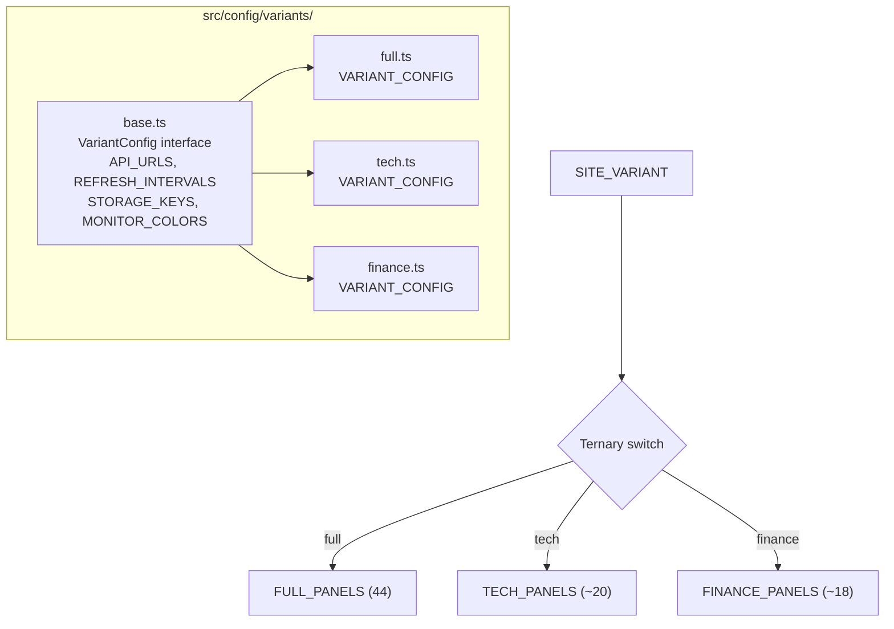

At build time, Vite's tree-shaking eliminates unused variant configs, keeping each deployed bundle lean.

---

## 4. Data Flow: RSS Ingestion to Display

The core intelligence pipeline transforms raw RSS feeds into clustered, classified, and scored events. The author chose to run this entire pipeline **in the browser** rather than on the server because: (a) it eliminates server-side compute costs, (b) it enables offline operation, and (c) it allows the ML refinement step to leverage the user's GPU via WebGL.

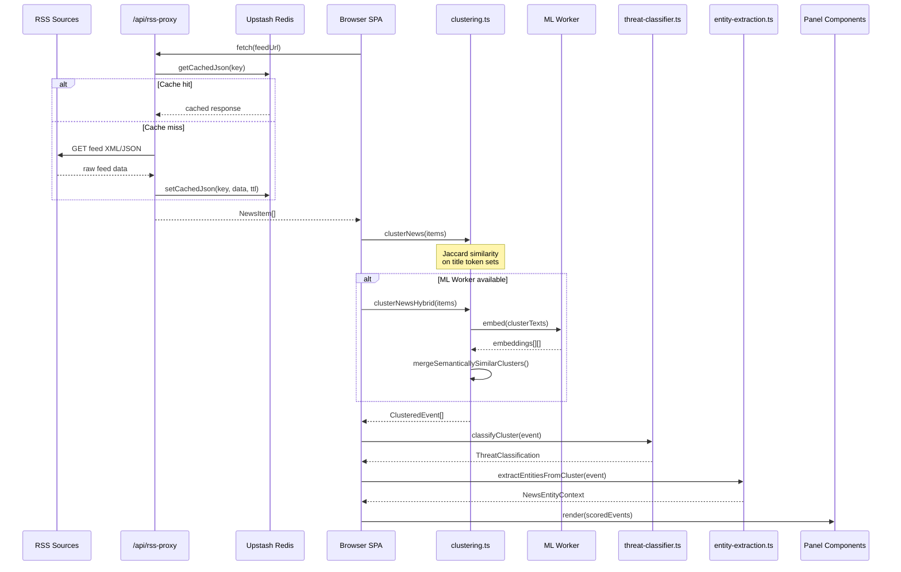

### Pipeline Stages in Detail

**Stage 1 — RSS Fetch** (`src/services/rss.ts`): The `fetchFeed()` function calls `/api/rss-proxy`. A per-feed in-memory cache prevents redundant network requests within the refresh interval (default 5 min). A persistent cache layer provides resilience across page reloads.

**Stage 2 — Clustering** (`src/services/clustering.ts`): Two strategies are available:
- `clusterNews(items)` — Fast Jaccard similarity over title token sets. Groups headlines with high textual overlap. Default when ML is unavailable.
- `clusterNewsHybrid(items)` — Refines Jaccard clusters using semantic embeddings from the ML Worker. `mergeSemanticallySimilarClusters()` joins clusters whose embedding centroids exceed the `semanticClusterThreshold` (0.75). Requires at least 5 initial clusters to activate.

**Stage 3 — Classification** (`src/services/threat-classifier.ts`): Each `ClusteredEvent` receives a `ThreatClassification` with level `critical | high | medium | low | info`. Uses keyword pattern matching and source-tier weighting.

**Stage 4 — Entity Extraction** (`src/services/entity-extraction.ts` + `entity-index.ts`): Matches text against a multi-index registry of 600+ entities (companies, countries, commodities, crypto). Five `Map` lookups: `byId`, `byAlias`, `byKeyword`, `bySector`, `byType`.

**Stage 5 — Display**: Classified and entity-enriched events distributed to panels via the `Panel` base class.

### News Item Lifecycle

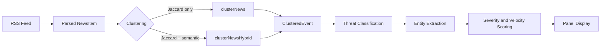

---

## 5. Signal Intelligence Pipeline

The signal aggregator **fuses 7 heterogeneous geospatial data sources** into a unified intelligence picture. The author built this because no single data source offers a complete operational picture — it's only by correlating internet outages with military flights with satellite fires in the same country within the same 24-hour window that meaningful intelligence emerges.

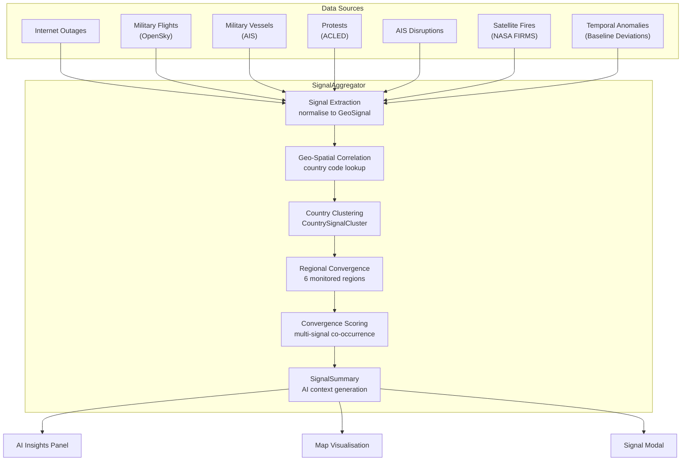

### Six Monitored Regions

| Region | Countries |
|---|---|
| Middle East | IR, IL, SA, AE, IQ, SY, YE, JO, LB, KW, QA, OM, BH |
| East Asia | CN, TW, JP, KR, KP, HK, MN |
| South Asia | IN, PK, BD, AF, NP, LK, MM |
| Eastern Europe | UA, RU, BY, PL, RO, MD, HU, CZ, SK, BG |
| North Africa | EG, LY, DZ, TN, MA, SD, SS |
| Sahel | ML, NE, BF, TD, NG, CM, CF |

The `convergenceScore` quantifies multi-signal co-occurrence per country. A high score means multiple independent signal types are present simultaneously — this drives the AI Insights panel prioritisation.

---

## 6. Map Rendering Pipeline

The author chose a **dual-renderer architecture** because the 3D WebGL map (deck.gl) delivers a stunning experience on desktop but would crash or stutter on mobile devices. The fallback D3/SVG renderer ensures every user gets a functional map.

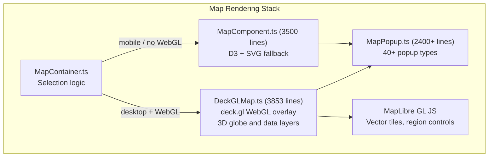

### Selection Logic

```
if (isMobileDevice() || !hasWebGLSupport())
  → MapComponent (D3/SVG)
else
  → DeckGLMap (WebGL/deck.gl)
```

### 20+ Static Infrastructure Datasets

The map embeds or lazily loads these datasets, each mapped to a toggle in `MapLayers`:

| Dataset | Constant | Layer Key |
|---|---|---|
| Intelligence hotspots | `INTEL_HOTSPOTS` | `hotspots` |
| Conflict zones | `CONFLICT_ZONES` | `conflicts` |
| Military bases | `MILITARY_BASES` | `bases` |
| Undersea cables | `UNDERSEA_CABLES` | `cables` |
| Nuclear facilities | `NUCLEAR_FACILITIES` | `nuclear` |
| Pipelines | `PIPELINES` | `pipelines` |
| Strategic waterways | `STRATEGIC_WATERWAYS` | `waterways` |
| AI data centers | `AI_DATA_CENTERS` | `datacenters` |
| Startup hubs | `STARTUP_HUBS` | `startupHubs` |
| Stock exchanges | `STOCK_EXCHANGES` | `stockExchanges` |
| ... and 13 more | | |

### Layer Toggle Resolution (3-tier override)

1. **Variant defaults** → `FULL_MAP_LAYERS` / `TECH_MAP_LAYERS` / `FINANCE_MAP_LAYERS`
2. **User localStorage** → key `worldmonitor-layers`, persists across sessions
3. **URL state** → query parameter overrides for shareable links (highest priority)

---

## 7. Component Architecture

### Component Counts

| Category | Count |
|---|---|
| Panel subclasses | ~35 |
| Map components | 4 (DeckGLMap, MapComponent, MapContainer, MapPopup) |
| Virtual scrolling | 2 (VirtualList, WindowedList) |
| Search | 1 (SearchModal) |
| Modals & widgets | ~9 |
| **Total** | **~51** |

### Panel Base Class (`Panel.ts`, 420 lines)

Every dashboard tile extends `Panel`. The author centralised all chrome (header, collapse/expand, resize handle, loading/error states, count badge, "NEW" badge, data-quality badge) into the base class so that subclasses only need to fill `.panel-content`.

```
div.panel#${id}                       ← root
 ├─ div.panel-header
 │   ├─ div.panel-header-left
 │   │   ├─ span.panel-title          ← title text
 │   │   ├─ span.panel-info-wrapper   ← ℹ icon + tooltip
 │   │   └─ span.panel-new-badge      ← "NEW" pill
 │   ├─ span.panel-data-badge         ← live/cached/unavailable dot
 │   └─ span.panel-count              ← count number
 ├─ div.panel-content                 ← subclass fills this
 └─ div.panel-resize-handle           ← drag handle
```

**Key Panel API:**

| Method | Description |
|---|---|
| `showLoading()` | Replaces content with a spinner |
| `showError(msg)` | Shows a red error banner |
| `setCount(n)` | Updates header count badge |
| `setDataBadge(state)` | Shows `live` / `cached` / `unavailable` dot |
| `setContent(html)` | Replaces panel-content |
| `destroy()` | Removes element, cleans up listeners |

### Virtual Scrolling

Two strategies for rendering large lists without creating thousands of DOM nodes:

- **VirtualList** — Fixed-height DOM-recycling scroller. Used for uniform-height items.
- **WindowedList\<T\>** — Variable-height chunk-based windowed scroller using `IntersectionObserver`. Used by `NewsPanel` with `chunkSize: 8`.

### SearchModal (`Ctrl+K`)

Global search with 20+ discriminated result types (`country | news | hotspot | market | prediction | conflict | base | pipeline | cable | datacenter | ...`). Scoring: prefix match = 2, substring = 1. Results sorted by priority tier. Recent selections persisted in localStorage (max 10).

### Component Interaction Diagram

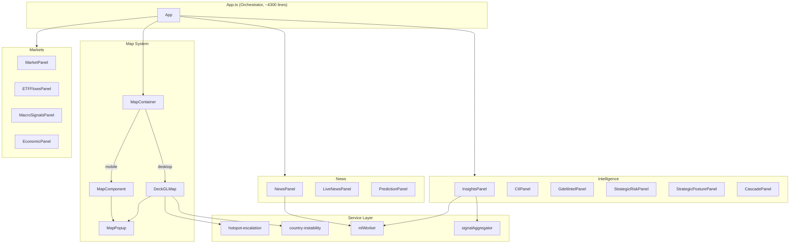

---

## 8. Complete Data Model Reference

> **Source of truth:** `src/types/index.ts` (1,297 lines, 60+ interfaces)

### Core News Pipeline

```typescript
interface NewsItem {
  source: string; title: string; link: string;
  pubDate: Date; isAlert: boolean;
  tier?: number; threat?: ThreatClassification;
  lat?: number; lon?: number; lang?: string;
}

interface ClusteredEvent {
  id: string; primaryTitle: string; primarySource: string;
  sourceCount: number;
  topSources: Array<{ name: string; tier: number; url: string }>;
  allItems: NewsItem[];
  firstSeen: Date; lastUpdated: Date;
  velocity?: VelocityMetrics; threat?: ThreatClassification;
}

interface VelocityMetrics {
  sourcesPerHour: number;
  level: 'normal' | 'elevated' | 'spike';
  trend: 'rising' | 'stable' | 'falling';
  sentiment: 'negative' | 'neutral' | 'positive';
  sentimentScore: number;
}
```

### Geopolitical & Military

```typescript
interface Hotspot {
  id: string; name: string; lat: number; lon: number;
  keywords: string[];
  escalationScore?: 1 | 2 | 3 | 4 | 5;
  escalationTrend?: 'escalating' | 'stable' | 'de-escalating';
}

interface MilitaryFlight {
  id: string; callsign: string;
  aircraftType: 'fighter' | 'bomber' | 'transport' | 'tanker' | 'awacs'
    | 'reconnaissance' | 'helicopter' | 'drone' | 'patrol' | 'unknown';
  operator: 'usaf' | 'raf' | 'plaaf' | 'vks' | 'nato' | 'other';
  lat: number; lon: number; altitude: number;
  heading: number; speed: number;
  confidence: 'high' | 'medium' | 'low';
}

interface MilitaryVessel {
  id: string; mmsi: string; name: string;
  vesselType: 'carrier' | 'destroyer' | 'frigate' | 'submarine'
    | 'amphibious' | 'patrol' | 'auxiliary' | 'unknown';
  isDark?: boolean; nearChokepoint?: string;
}

interface ConflictZone {
  id: string; name: string;
  coords: [number, number][]; center: [number, number];
  intensity?: 'high' | 'medium' | 'low';
  parties?: string[];
}
```

### Infrastructure

```typescript
interface UnderseaCable {
  id: string; name: string;
  points: [number, number][];
  landingPoints?: CableLandingPoint[];
  capacityTbps?: number; rfsYear?: number;
}

interface Pipeline {
  id: string; name: string;
  type: 'oil' | 'gas' | 'products';
  status: 'operating' | 'construction';
  capacityMbpd?: number; capacityBcmY?: number;
}

interface InternetOutage {
  id: string; title: string;
  country: string; lat: number; lon: number;
  severity: 'partial' | 'major' | 'total';
}

// The cascade analysis system models infrastructure dependency graphs:
type InfrastructureNodeType = 'cable' | 'pipeline' | 'port' | 'chokepoint' | 'country';
type DependencyType = 'serves' | 'terminates_at' | 'transits_through'
  | 'depends_on' | 'shares_risk' | 'alternative_to' | 'trade_route';
```

### Markets & Finance

```typescript
interface MarketData {
  symbol: string; name: string; price: number | null;
  change: number | null; sparkline?: number[];
}

interface GulfInvestment {
  id: string;
  investingEntity: 'DP World' | 'Mubadala' | 'ADIA' | 'PIF' | 'Saudi Aramco' | ...;
  sector: 'ports' | 'pipelines' | 'energy' | 'datacenters' | ...;
  status: 'operational' | 'under-construction' | 'announced';
  investmentUSD?: number; stakePercent?: number;
}
```

### Tech Variant Types

```typescript
interface AIDataCenter {
  id: string; name: string; owner: string;
  chipType: string; chipCount: number; powerMW?: number;
  status: 'existing' | 'planned' | 'decommissioned';
}

interface AIRegulation {
  id: string; name: string; country: string;
  type: 'comprehensive' | 'sectoral' | 'voluntary' | 'proposed';
  effectiveDate?: string; complianceDeadline?: string;
  keyProvisions: string[]; penalties?: string;
}

interface StartupEcosystem {
  id: string; city: string; country: string;
  ecosystemTier?: 'tier1' | 'tier2' | 'tier3' | 'emerging';
  unicorns?: number; activeStartups?: number;
}
```

### Signal Model

```typescript
type SignalType = 'internet_outage' | 'military_flight' | 'military_vessel'
  | 'protest' | 'ais_disruption' | 'satellite_fire' | 'temporal_anomaly';

interface GeoSignal {
  type: SignalType; country: string;
  lat: number; lon: number;
  severity: 'low' | 'medium' | 'high';
  title: string; timestamp: Date;
}

interface SignalSummary {
  timestamp: Date; totalSignals: number;
  byType: Record<SignalType, number>;
  convergenceZones: RegionalConvergence[];
  topCountries: CountrySignalCluster[];
  aiContext: string;  // Pre-formatted LLM prompt context
}
```

### MapLayers (35+ boolean toggles)

```typescript
interface MapLayers {
  // Geopolitical
  conflicts: boolean; bases: boolean; hotspots: boolean;
  military: boolean; sanctions: boolean;
  // Infrastructure
  cables: boolean; pipelines: boolean; nuclear: boolean;
  datacenters: boolean; waterways: boolean; spaceports: boolean;
  // Security
  cyberThreats: boolean; outages: boolean;
  // Environmental
  weather: boolean; fires: boolean; natural: boolean; climate: boolean;
  // Tracking
  ais: boolean; flights: boolean; protests: boolean;
  // Economic
  economic: boolean; stockExchanges: boolean;
  financialCenters: boolean; centralBanks: boolean;
  // Tech variant
  startupHubs: boolean; cloudRegions: boolean;
  accelerators: boolean; techHQs: boolean;
  // ... 35+ total
}
```

---

## 9. State Management

The author chose **no reactive state system** (no Redux, Zustand, MobX, signals). Every state update is an explicit imperative call. The rationale: with 44 panels updating at staggered intervals from 30+ data sources, a reactive system would generate cascading re-renders. Manual updates are more predictable and debuggable.

### Application State Flow

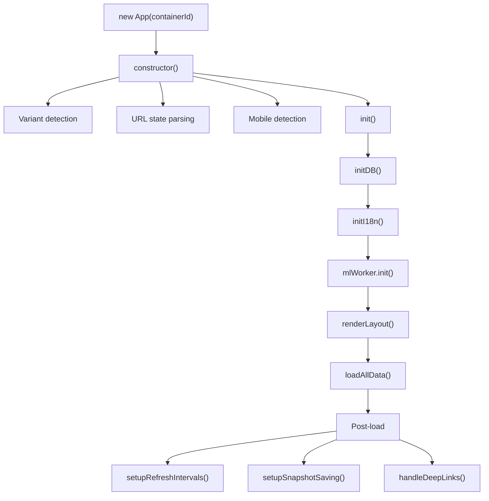

### Data Flow Pattern (every update)

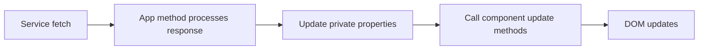

### All App.ts State Properties

The `App` class (~4,300 lines) maintains all state as private properties:

**Data State:** `allNews`, `newsByCategory`, `latestPredictions`, `latestMarkets`, `latestClusters`, `currentTimeRange`, `monitors`, `panelSettings`, `mapLayers`, `cyberThreatsCache`

**Component Refs:** `map`, `panels`, `newsPanels`, `signalModal`, `playbackControl`, `statusPanel`, `searchModal`, `countryBriefPage`

**UI State:** `isPlaybackMode`, `isMobile`, `initialLoadComplete`, `isIdle`, `isDestroyed`, `isDesktopApp`

**Infrastructure:** `inFlight` (Set), `seenGeoAlerts` (Set), `disabledSources` (Set), `mapFlashCache` (Map)

### App Lifecycle

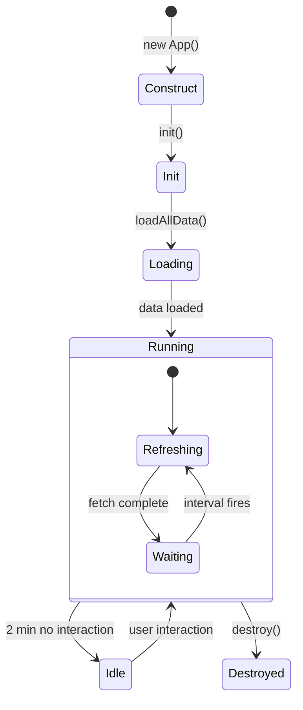

### Complete localStorage Keys

| Key | Purpose | Format |
|-----|---------|--------|
| `worldmonitor-variant` | Active variant override | `'full' \| 'tech' \| 'finance'` |
| `worldmonitor-theme` | Theme preference | `'dark' \| 'light'` |
| `panel-order` | Panel arrangement | `string[]` (JSON) |
| `worldmonitor-panel-spans` | Panel grid sizes | `Record<string, number>` |
| `worldmonitor-panels` | Panel enabled state | `Record<string, PanelConfig>` |
| `worldmonitor-monitors` | Monitor configs | `Monitor[]` |
| `worldmonitor-layers` | Map layer toggles | `MapLayers` |
| `worldmonitor-disabled-feeds` | Disabled news sources | `string[]` |
| `worldmonitor-runtime-feature-toggles` | Desktop feature toggles | `Record<FeatureId, boolean>` |
| `worldmonitor-persistent-cache:{key}` | Persistent data cache | `CacheEnvelope<T>` |
| `worldmonitor_recent_searches` | Recent search results | max 10 entries |

### Theme Application Flow

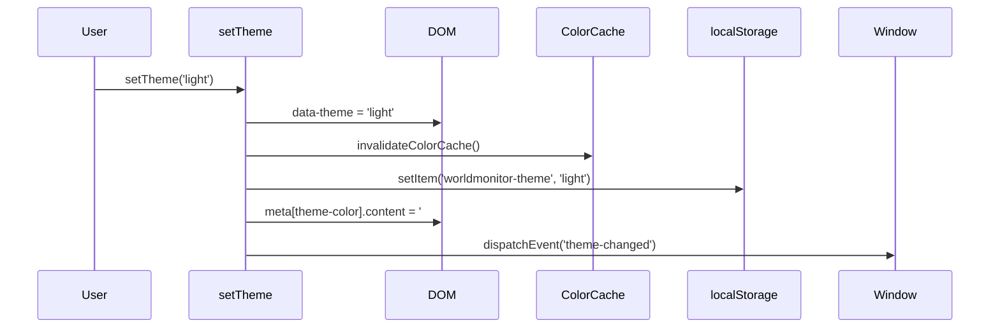

### IndexedDB Schema (`worldmonitor_db`)

| Store | keyPath | Purpose |
|---|---|---|
| `baselines` | `key` | Rolling 30-day statistical baselines for anomaly detection. z-score > 2.5 = `spike`, > 1.5 = `elevated`, < -2 = `quiet`. |
| `snapshots` | `timestamp` | Periodic dashboard state captures for time-travel playback. 7-day retention. |

---

## 10. Caching Architecture (5 Tiers)

The author designed a **five-tier caching strategy** because the system polls 30+ external APIs at staggered intervals. Without aggressive caching, API rate limits would be exceeded within minutes and latency would degrade the real-time experience.

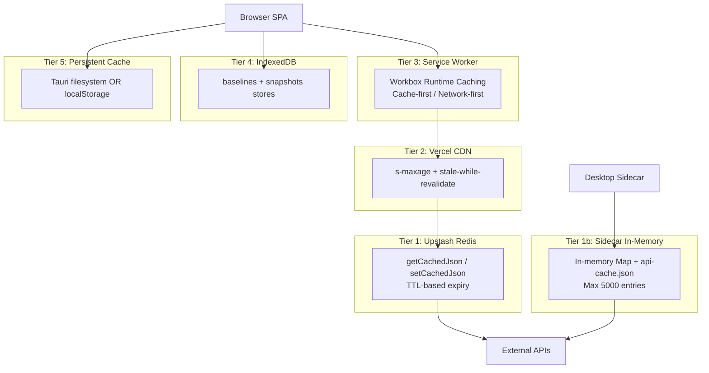

---

## 11. Desktop Architecture (Tauri)

The author chose **Tauri 2 over Electron** because Tauri produces 5–10x smaller binaries (Rust vs Chromium), and the Rust backend enables **OS keychain storage** for 18 API keys — eliminating the need to store secrets in environment variables or config files.

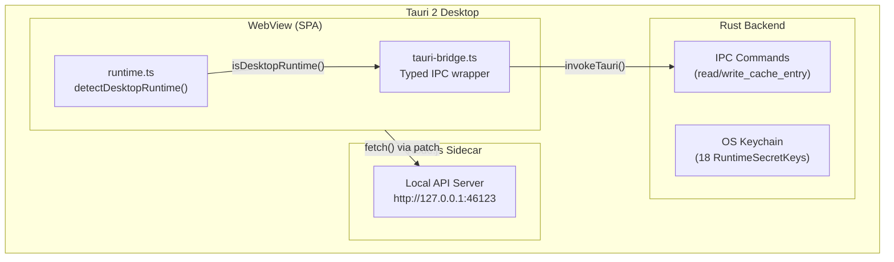

### 18 Runtime Secret Keys

`GROQ_API_KEY`, `OPENROUTER_API_KEY`, `FRED_API_KEY`, `EIA_API_KEY`, `CLOUDFLARE_API_TOKEN`, `ACLED_ACCESS_TOKEN`, `URLHAUS_AUTH_KEY`, `OTX_API_KEY`, `ABUSEIPDB_API_KEY`, `WINGBITS_API_KEY`, `WS_RELAY_URL`, `OPENSKY_RELAY_URL`, `OPENSKY_CLIENT_ID`, `OPENSKY_CLIENT_SECRET`, `AISSTREAM_API_KEY`, `FINNHUB_API_KEY`, `NASA_FIRMS_API_KEY`, `UCDP_KEY`

### 14 Feature Toggles

`aiGroq`, `aiOpenRouter`, `economicFred`, `energyEia`, `internetOutages`, `acledConflicts`, `abuseChThreatIntel`, `alienvaultOtxThreatIntel`, `abuseIpdbThreatIntel`, `wingbitsEnrichment`, `aisRelay`, `openskyRelay`, `finnhubMarkets`, `nasaFirms`

Each feature declares its required secrets. The settings UI validates secret availability before allowing a feature to be enabled.

---

## 12. ML Pipeline

The author chose **in-browser ML over cloud-only** because: (a) it enables fully offline operation on the desktop app, (b) it eliminates per-inference API costs, and (c) the embeddings model (23 MB) is small enough to download once and cache permanently.

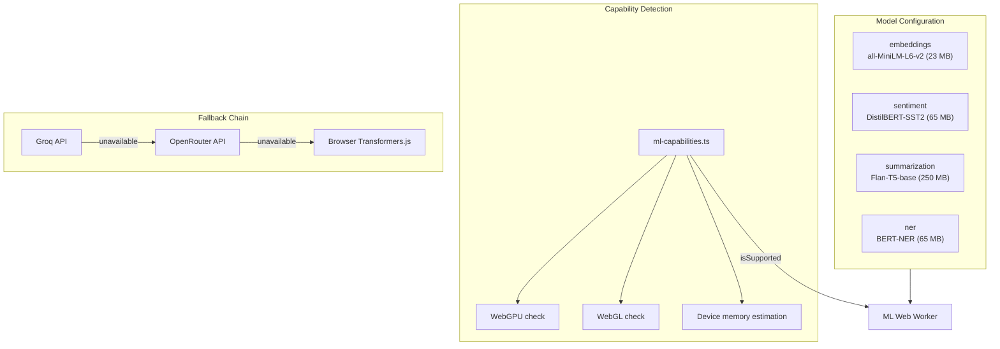

### ML Thresholds

| Constant | Value | Purpose |
|---|---|---|
| `semanticClusterThreshold` | 0.75 | Cosine similarity for merging clusters |
| `minClustersForML` | 5 | Minimum clusters before ML refinement |
| `maxTextsPerBatch` | 20 | Batch size for embedding requests |
| `modelLoadTimeoutMs` | 600,000 (10 min) | Model download/compile timeout |
| `inferenceTimeoutMs` | 120,000 (2 min) | Per-inference call timeout |
| `memoryBudgetMB` | 200 | Max memory for all loaded models |

ML is only enabled on desktop-class devices with at least WebGL support and 100+ MB estimated available memory.

---

## 13. Error Handling & Circuit Breakers

The author implemented a **circuit-breaker pattern** because with 30+ external APIs, at least one is always experiencing issues. Without circuit breakers, a single slow API would block the entire dashboard's refresh cycle.

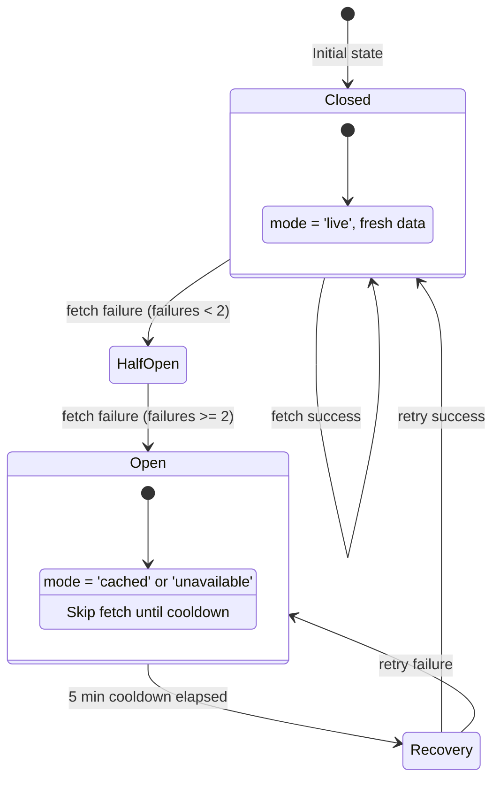

### Circuit Breaker Constants

| Constant | Default | Purpose |
|---|---|---|
| `DEFAULT_MAX_FAILURES` | 2 | Consecutive failures before opening |
| `DEFAULT_COOLDOWN_MS` | 5 min | Cooldown before retry |
| `DEFAULT_CACHE_TTL_MS` | 10 min | How long stale cache remains valid |

### Degradation Hierarchy

```
Live data (fresh fetch)
  └── on failure →  Stale cache (within 10 min TTL)
        └── expired →  'unavailable' state in UI
              └── desktop offline →  immediate cache fallback
```

Each panel manages its own breaker independently — a failure in OpenSky doesn't affect Finnhub or ACLED.

---

## 14. Variant Visibility Matrix

| Component | `full` | `tech` | `finance` |
|---|:---:|:---:|:---:|
| InsightsPanel | ✅ | ✅ | ✅ |
| CIIPanel (Country Instability) | ✅ | — | — |
| GdeltIntelPanel | ✅ | — | — |
| StrategicRiskPanel | ✅ | — | — |
| StrategicPosturePanel | ✅ | — | — |
| CascadePanel | ✅ | — | — |
| NewsPanel | ✅ | ✅ | ✅ |
| LiveNewsPanel | ✅ | ✅ | — |
| PredictionPanel | ✅ | ✅ | ✅ |
| MarketPanel | ✅ | ✅ | ✅ |
| ETFFlowsPanel | ✅ | ✅ | ✅ |
| MacroSignalsPanel | ✅ | ✅ | ✅ |
| EconomicPanel | ✅ | ✅ | ✅ |
| InvestmentsPanel (Gulf FDI) | — | — | ✅ |
| UcdpEventsPanel | ✅ | — | — |
| ClimateAnomalyPanel | ✅ | ✅ | — |
| SatelliteFiresPanel | ✅ | — | — |
| DisplacementPanel | ✅ | — | — |
| TechEventsPanel | — | ✅ | — |
| TechHubsPanel | — | ✅ | — |
| TechReadinessPanel | — | ✅ | — |
| RegulationPanel | — | ✅ | — |
| ServiceStatusPanel | — | ✅ | — |
| MonitorPanel | ✅ | ✅ | ✅ |
| PlaybackControl | ✅ | ✅ | ✅ |
| PizzIntIndicator | ✅ | — | — |
| IntelligenceFindingsBadge | ✅ | — | — |

---

> **Document stats (Part 1):** ~7,200 words · 14 sections · 12 mermaid diagrams · Type specs for 60+ interfaces · Full localStorage key reference.

---

# Part 2 — External APIs, Endpoints, Panel System & Operational Reference

---

## 15. External APIs Catalog (38 Sources)

World Monitor integrates **38 distinct external API sources** plus ~150 RSS feed domains. The author chose this breadth-first approach because no single provider covers every intelligence domain — geopolitical, financial, military, environmental, humanitarian, and technology data each require specialised sources. The redundancy also means the dashboard degrades gracefully when any single source goes offline.

### API Authentication Breakdown

| Auth Type | Count | Examples |
|---|---|---|
| **API key required** | 10 | ACLED, Finnhub, FRED, NASA FIRMS, Groq, OpenRouter, Cloudflare Radar, AbuseIPDB, Wingbits, EIA |
| **API key optional** | 2 | GitHub (higher rate limits), HDX HAPI |
| **No auth (public)** | 26 | UCDP, GDELT, Yahoo Finance, CoinGecko, USGS, NOAA, OpenSky, Status Pages, RSS, etc. |
| **URL-based auth** | 1 | Custom AIS Relay (credentials embedded in WS_RELAY_URL) |

### Geopolitical Data Sources

| # | API | Base URL | Auth | Cache TTL | Why Used |
|---|---|---|---|---|---|
| 1 | **ACLED** | `api.acleddata.com/acled/read` | Key + Email | 600 s | Gold standard for armed conflict events. Covers battles, violence against civilians, riots, protests globally. Data lags 1-2 weeks but is rigorously validated. |
| 2 | **UCDP** | `ucdpapi.pcr.uu.se/api/` | None | 24 h | Academic conflict dataset from Uppsala University. Provides state-based, non-state, and one-sided violence categories. Complements ACLED with longer historical depth. |
| 3 | **GDELT** | `api.gdeltproject.org/api/v2/` | None | 300 s | World's largest open human event database. DOC 2.0 API for full-text search, GEO 2.0 for geographic heat-mapping. Updates every 15 minutes. |
| 4 | **NGA MSI** | `msi.gs.mil/api/` | None | 3600 s | US National Geospatial-Intelligence Agency maritime safety warnings. NAVAREA notices, HYDROLANT/HYDROPAC. US DoD-hosted; occasionally slow. |

### Markets & Finance Sources

| # | API | Auth | Rate Limit | Why Used |
|---|---|---|---|---|
| 5 | **Finnhub** | API key | 60/min | Primary equities data. Free tier covers stock quotes, ETF data. WebSocket available but WM uses REST polling for simplicity. |
| 6 | **Yahoo Finance** | None | Unofficial | Undocumented endpoint for chart/sparkline data. **No official API** — may break without notice. Used because it's the only free source for intraday OHLCV data for international indices. |
| 7 | **CoinGecko** | None | 10-30/min | Free crypto market data with sparklines. Rate limits fluctuate — aggressive caching essential. Feeds into CryptoPanel, StablecoinPanel, and MacroSignals. |
| 8 | **FRED** | API key | 120/min | Federal Reserve Economic Data — treasury yields, interest rates, unemployment. Series IDs must be known in advance. Updates on Fed schedule, not real-time. |
| 9 | **Polymarket** | None | Public | Prediction markets via Gamma off-chain API. Filterable by tag for geopolitical/election markets. Market slugs can change. |
| 10 | **alternative.me** | None | Public | Crypto Fear & Greed Index (0–100). Single lightweight endpoint feeding into macro signals composite. |
| 11 | **blockchain.info** | None | Public | BTC network hash rate. Used specifically as a macro signal input — hash rate trends correlate with miner confidence. |

### Military & Security Sources

| # | API | Auth | Data Format | Why Used |
|---|---|---|---|---|
| 12 | **OpenSky** | None | JSON | ADS-B aircraft positions. Anonymous rate limit (100/day) is tight. Military aircraft identified by callsign pattern matching against a known-patterns database. |
| 13 | **Wingbits** | Commercial key | JSON | Premium ADS-B data with higher fidelity in specific regions. Augments OpenSky where coverage gaps exist. **Only paid API that is not optional.** |
| 14 | **AIS Relay** | URL-based | WebSocket → JSON | Self-hosted relay decoding AIS NMEA sentences. Provides vessel positions for the maritime tracking layer. Custom `ais-relay.cjs` script with systemd service config. |
| 15-19 | **Cyber Threat Feeds** | Mixed | CSV + JSON | Five sources aggregated into `/api/cyber-threats`: Feodo Tracker (C2 botnets), URLhaus (malicious URLs), C2IntelFeeds (community IPs), AlienVault OTX (IoC pulses), AbuseIPDB (IP reputation). Each source independently optional — the aggregator includes whatever is available. |

### Natural Events Sources

| # | API | Auth | Cache TTL | Why Used |
|---|---|---|---|---|
| 20 | **USGS** | None | 300 s | Earthquake data as GeoJSON. Pre-built feeds by magnitude — no query API, just static feeds USGS regenerates every 5 min. |
| 21 | **NASA FIRMS** | API key | 600 s | VIIRS and MODIS satellite fire detection. CSV format parsed server-side. Area/country queries — global queries produce very large CSV files, so WM limits to regions. |
| 22 | **NOAA** | None | 6 h | Global temperature/precipitation anomalies. Monthly resolution — not real-time. Multiple sub-endpoints aggregated for 15 climate zones. |

### AI / ML Sources

| # | API | Auth | Why Used |
|---|---|---|---|
| 23 | **Groq** | API key | Primary LLM provider. Ultra-fast inference via custom LPU hardware. OpenAI-compatible API. Used for summarisation, classification, and country intelligence briefs. |
| 24 | **OpenRouter** | API key | Secondary/fallback LLM. Aggregator routing to multiple providers. Specific free models (e.g., `mistralai/mistral-7b-instruct:free`) used to avoid cost. Falls back to browser Transformers.js if unavailable. |

### LLM Fallback Chain

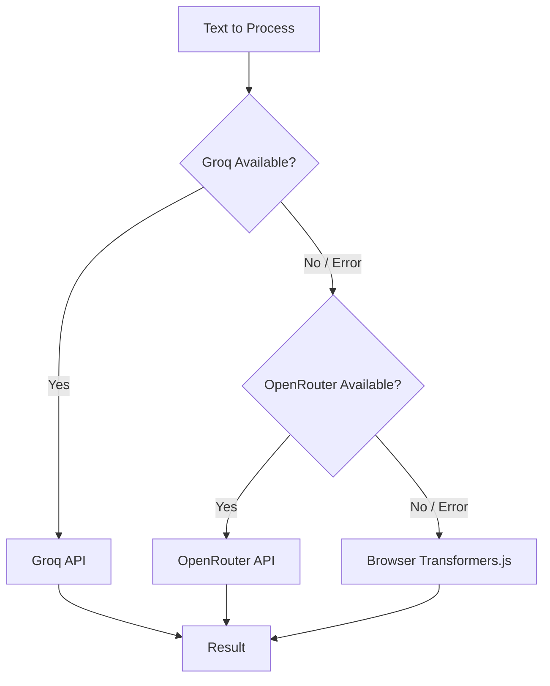

The author designed this three-tier fallback because: (a) Groq has the fastest inference but occasional rate limit hits, (b) OpenRouter provides redundancy across multiple LLM providers, and (c) Transformers.js guarantees the feature works even fully offline on the desktop app.

### Infrastructure & Status Sources

| # | API | Auth | Why Used |
|---|---|---|---|
| 25 | **Cloudflare Radar** | Enterprise token | Internet outage detection globally. Requires enterprise-level API token — optional enhancement. |
| 26 | **Status Pages (33 services)** | None | Monitors AWS, Azure, GCP, GitHub, Cloudflare, Stripe, Twilio, Datadog, PagerDuty, Slack, Discord, Zoom, Atlassian, OpenAI, Anthropic, and 19 more. All use Atlassian Statuspage JSON format. Circuit breaker per source prevents one broken page from blocking others. |
| 27 | **FAA ASWS** | None | US airport ground delays, ground stops, and closures. XML parsed server-side. |

### Humanitarian Sources

| # | API | Auth | Cache TTL | Why Used |
|---|---|---|---|---|
| 28 | **UNHCR** | None | 24 h | Refugee and displaced population statistics. Annual granularity. Long cache TTL because data changes slowly. |
| 29 | **HDX HAPI** | Optional | 6 h | OCHA's Humanitarian Data Exchange. Food security, operational presence. Higher rate limits with app identifier. |
| 30 | **WorldPop** | None | 7 d | Population density for exposure analysis ("how many people near this earthquake?"). Very long TTL. |
| 31 | **World Bank** | None | 24 h | Development indicators (GDP, population). Must specify `format=json` — default is XML. |

### Content & Research Sources

| # | API | Auth | Why Used |
|---|---|---|---|
| 32 | **Hacker News** | None | Firebase API. Each story requires a separate fetch by ID — WM batch-fetches top N story IDs then details. |
| 33 | **GitHub** | Optional | Trending repos via search API with date filters. Falls back to HTML scraping `github.com/trending`. Token recommended to avoid 60 req/h anonymous limit. |
| 34 | **ArXiv** | None | Academic paper search. Atom XML parsed server-side. ArXiv requests polite rate (3s between requests). |
| 35 | **EIA** | API key | US energy data — petroleum, natural gas, electricity. V2 API with hierarchical facet structure. |
| 36 | **pizzint.watch** | None | OSINT aggregation platform. Multiple sub-endpoints proxied through WM edge functions. |
| 37 | **RSS Feeds (~150 domains)** | None | Wire services (AP, Reuters, AFP), regional news, defense publications, financial outlets, tech media, and OSINT sources. Per-feed circuit breaker with 5-min cooldown. |
| 38 | **Tech Events** | None | Scraped conference/event listings. HTML parsing — fragile if source layouts change. Long 6h cache TTL. |

---

## 16. Vercel Edge API Reference

The API layer consists of **60+ serverless endpoints** deployed as Vercel Edge Functions. The author chose Edge Functions over traditional serverless because they execute at the CDN edge closest to the user, reducing latency by 50-200ms per request compared to region-based functions.

### Shared Middleware Stack

Every endpoint uses 4 shared middleware modules (prefixed with `_` to prevent Vercel from deploying them as routes):

#### `_cors.js` — Origin Allowlist

8 regex patterns control access: `worldmonitor.app`, `*.worldmonitor.app`, `*.vercel.app`, `localhost:*`, `127.0.0.1:*`, `[::1]:*`, `tauri://localhost`, `https://tauri.localhost`. This strict allowlist prevents unauthorized API consumption while supporting all deployment modes (production, preview, local dev, desktop).

#### `_upstash-cache.js` — Dual-Mode Cache

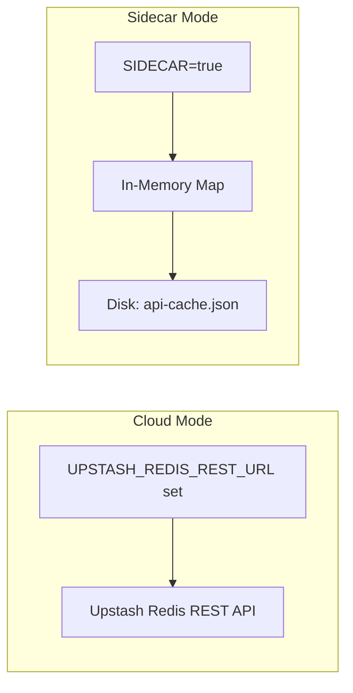

**Cloud Mode:** Uses Upstash Redis REST API (no persistent connections needed — critical for serverless). Functions: `getCachedJson(key)`, `setCachedJson(key, value, ttlSeconds)`, `mget(...keys)`.

**Sidecar Mode:** In-memory `Map` with disk persistence to `./data/upstash-cache.json`. Max 5,000 entries with LRU eviction. Disk snapshot read on cold start.

#### `_ip-rate-limit.js` — Sliding Window

Factory function `createIpRateLimiter({ limit, windowMs, maxEntries, cleanupIntervalMs })`. Defaults: 60 requests per 60s window, max 10,000 tracked IPs. LRU eviction prevents memory leaks. Returns 429 with `Retry-After` header.

#### `_cache-telemetry.js` — HIT/MISS Tracking

Records per-endpoint cache outcomes (HIT, MISS, STALE). Max 128 tracked endpoints. Console-logs summary every 50 recordings. Exposed via `GET /api/cache-telemetry`.

### Endpoint Quick Reference

| Endpoint | Method | Auth | Cache TTL | Rate Limit |
|---|---|---|---|---|
| `/api/acled` | GET | ACLED key + email | 600 s | 10/min |
| `/api/acled-conflict` | GET | ACLED key + email | 600 s | 10/min |
| `/api/ucdp` | GET | — | 86,400 s (24h) | — |
| `/api/ucdp-events` | GET | — | 21,600 s (6h) | 15/min |
| `/api/gdelt-doc` | GET | — | CDN 300 s | — |
| `/api/gdelt-geo` | GET | — | CDN 300 s | — |
| `/api/nga-warnings` | GET | — | CDN 3,600 s | — |
| `/api/country-intel` | POST | Groq key | 7,200 s (2h) | — |
| `/api/finnhub` | GET | Finnhub key | CDN 60 s | — |
| `/api/yahoo-finance` | GET | — | CDN 60 s | — |
| `/api/coingecko` | GET | — | 120 s | — |
| `/api/stablecoin-markets` | GET | — | In-mem 120 s | — |
| `/api/etf-flows` | GET | Finnhub key | In-mem 900 s | — |
| `/api/stock-index` | GET | — | 3,600 s | — |
| `/api/fred-data` | GET | FRED key | 3,600 s | — |
| `/api/macro-signals` | GET | FRED + Finnhub | In-mem 300 s | — |
| `/api/polymarket` | GET | — | 300 s | — |
| `/api/opensky` | GET | — | CDN 15 s | — |
| `/api/ais-snapshot` | GET | WS_RELAY_URL | 3-tier 4-8 s | — |
| `/api/theater-posture` | GET | — | 3-tier 5min-7d | — |
| `/api/cyber-threats` | GET | AbuseIPDB (opt.) | 600 s | 20/min |
| `/api/earthquakes` | GET | — | CDN 300 s | — |
| `/api/firms-fires` | GET | NASA FIRMS key | 600 s | — |
| `/api/climate-anomalies` | GET | — | 21,600 s (6h) | 15/min |
| `/api/classify-batch` | POST | Groq key | 86,400 s (24h) | — |
| `/api/classify-event` | GET | Groq key | 86,400 s (24h) | — |
| `/api/groq-summarize` | POST | Groq key | 3,600 s | — |
| `/api/openrouter-summarize` | POST | OpenRouter key | 3,600 s | — |
| `/api/cloudflare-outages` | GET | CF token | 600 s | — |
| `/api/service-status` | GET | — | In-mem 60 s | — |
| `/api/faa-status` | GET | — | CDN 300 s | — |
| `/api/unhcr-population` | GET | — | 86,400 s (24h) | 20/min |
| `/api/hapi` | GET | HDX (opt.) | 21,600 s (6h) | — |
| `/api/worldpop-exposure` | GET | — | 604,800 s (7d) | 30/min |
| `/api/worldbank` | GET | — | 86,400 s (24h) | — |
| `/api/rss-proxy` | GET | — | CDN 300 s | — |
| `/api/hackernews` | GET | — | CDN 300 s | — |
| `/api/github-trending` | GET | GitHub (opt.) | 3,600 s | — |
| `/api/tech-events` | GET | — | 21,600 s (6h) | — |
| `/api/arxiv` | GET | — | CDN 3,600 s | — |
| `/api/risk-scores` | GET | — | 600 s | — |
| `/api/temporal-baseline` | GET/POST | — | 90 d | — |
| `/api/eia/*` | GET | EIA key | CDN 3,600 s | — |
| `/api/pizzint/*` | GET | — | CDN 120 s | — |
| `/api/wingbits/*` | GET | Wingbits key | CDN 15-300 s | — |

### Composite Endpoints (Multi-Source)

Three endpoints aggregate multiple upstream APIs into a single response. The author built these because the frontend shouldn't need to make 5+ parallel requests and reconcile the results:

#### Macro Signals Composite

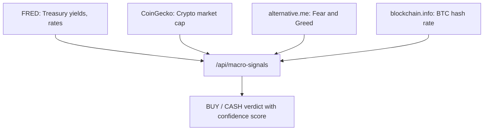

#### Cyber Threats Aggregation

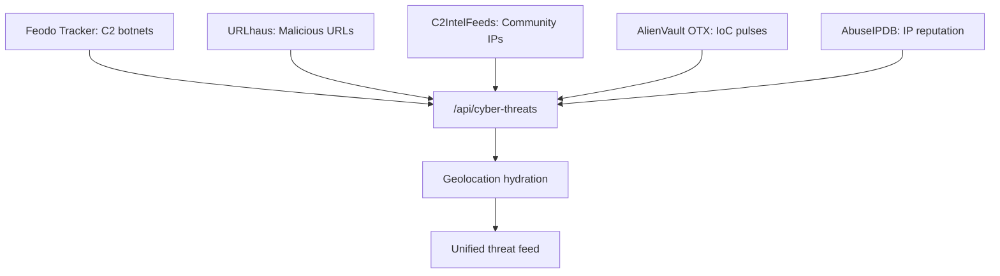

#### Theater Posture Analysis

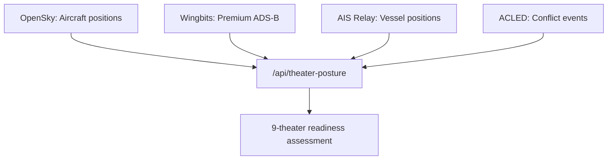

### Graceful Degradation Pattern

All endpoints follow the same pattern when credentials are missing:

```typescript
// Standard graceful degradation:
if (!process.env.REQUIRED_API_KEY) {
  return Response.json({ success: true, data: [], unavailable: true });
}
```

This returns a valid, parseable response instead of a 5xx error, allowing the frontend to show "data unavailable" rather than a broken panel.

---

## 17. Panel System Deep Dive

The panel system is **config-driven**: every dashboard tile is declared as a `PanelConfig` entry inside a variant-specific configuration object. The author chose this approach over hardcoded panel construction because it enables: (a) variant-specific panel sets from a single codebase, (b) user customisation (toggle, reorder, resize), and (c) automatic generation of RSS-based panels from feed configuration.

### Panel Counts by Variant

| Variant | Domain | Panels | Exclusive Panels |
|---|---|---|---|
| **Full** | worldmonitor.io | 37 | strategic-posture, cii, strategic-risk, gdelt-intel, cascade, satellite-fires, ucdp-events, displacement, climate, population-exposure, middleeast, africa, latam, asia |
| **Tech** | tech.worldmonitor.io | 34 | startups, vcblogs, regionalStartups, unicorns, accelerators, security, policy, regulation, hardware, cloud, dev, github, funding, producthunt, events, service-status, tech-readiness |
| **Finance** | finance.worldmonitor.io | 29 | markets-news, forex, bonds, commodities-news, crypto-news, centralbanks, economic-news, derivatives, fintech, institutional, analysis, gcc-investments, gccNews |

### Full Variant Panels (37 panels)

| # | Panel ID | Display Name | P | Component | Data Source |
|---|---|---|---|---|---|
| 1 | `map` | Global Map | 1 | MapContainer | MapLibre + deck.gl |
| 2 | `live-news` | Live News | 1 | LiveNewsPanel | Multi-source RSS |
| 3 | `live-webcams` | Live Webcams | 1 | LiveWebcamsPanel | Curated streams |
| 4 | `insights` | AI Insights | 1 | InsightsPanel | Groq/OpenRouter |
| 5 | `strategic-posture` | AI Strategic Posture | 1 | StrategicPosturePanel | Theater posture API |
| 6 | `cii` | Country Instability | 1 | CIIPanel | Composite index |
| 7 | `strategic-risk` | Strategic Risk Overview | 1 | StrategicRiskPanel | Risk scores API |
| 8 | `intel` | Intel Feed | 1 | NewsPanel | Intelligence RSS |
| 9 | `gdelt-intel` | Live Intelligence | 1 | GdeltIntelPanel | GDELT |
| 10 | `cascade` | Infrastructure Cascade | 1 | CascadePanel | Cascade analysis |
| 11-18 | Regional news | politics, middleeast, africa, latam, asia, energy, gov, thinktanks | 1 | NewsPanel | Regional RSS |
| 19 | `polymarket` | Predictions | 1 | PredictionPanel | Polymarket API |
| 20 | `commodities` | Commodities | 1 | CommoditiesPanel | Yahoo/commodity APIs |
| 21 | `markets` | Markets | 1 | MarketPanel | Finnhub/Yahoo |
| 22 | `economic` | Economic Indicators | 1 | EconomicPanel | FRED API |
| 23-37 | Supplementary | finance, tech, crypto, heatmap, ai, layoffs, monitors, satellite-fires, macro-signals, etf-flows, stablecoins, ucdp-events, displacement, climate, population-exposure | 2 | Various | Various |

### Tech Variant Panels (34 panels)

| # | Panel ID | Display Name | P | Exclusive |
|---|---|---|---|---|
| 1 | `map` | Global Tech Map | 1 | — |
| 2 | `live-news` | Tech Headlines | 1 | — |
| 3-6 | `ai`, `tech`, `startups`, `vcblogs` | AI/ML, Technology, Startups & VC, VC Insights | 1 | ✅ (startups, vcblogs) |
| 7-11 | `regionalStartups`, `unicorns`, `accelerators`, `security`, `policy` | Regional, Unicorn, Accelerator, Cybersecurity, AI Policy | 1 | ✅ All |
| 12 | `regulation` | AI Regulation Dashboard | 1 | ✅ |
| 13-22 | Various | hardware, cloud, dev, github, funding, producthunt, events, service-status, tech-readiness, etc. | 1-2 | ✅ Most |
| 23-34 | Shared | markets, finance, crypto, economic, macro-signals, etf-flows, stablecoins, monitors, etc. | 2 | — |

### Finance Variant Panels (29 panels)

| # | Panel ID | Display Name | P | Exclusive |
|---|---|---|---|---|
| 1 | `map` | Global Markets Map | 1 | — |
| 2 | `live-news` | Market Headlines | 1 | — |
| 3-5 | `markets`, `forex`, `bonds` | Live Markets, Forex & Currencies, Fixed Income | 1 | ✅ (forex, bonds) |
| 6-8 | `commodities`, `commodities-news`, `crypto` | Commodities, Commodities News, Crypto | 1-2 | ✅ (commodities-news) |
| 9-13 | `centralbanks`, `economic`, `ipo`, `heatmap`, `macro-signals` | Central Bank Watch, Economic Data, IPOs, Sector Heatmap, Market Radar | 1 | ✅ (centralbanks) |
| 14-16 | `derivatives`, `fintech`, `institutional` | Derivatives, Fintech, Hedge Funds & PE | 2 | ✅ All |
| 17-20 | `gcc-investments`, `gccNews`, `analysis`, `regulation` | GCC Investments, GCC News, Market Analysis, Financial Regulation | 2 | ✅ All |
| 21-29 | Shared | crypto-news, economic-news, etf-flows, stablecoins, polymarket, monitors, etc. | 2 | — |

### Panel Registration Flow

```mermaid
flowchart TD
    A["App Constructor"] --> B{"Variant Changed?"}
    B -->|Yes| C["Reset localStorage: Use DEFAULT_PANELS"]
    B -->|No| D["Load panelSettings from localStorage"]
    C --> E["render: Build DOM Shell"]
    D --> E
    E --> F["createPanels: Instantiate all classes"]
    F --> G["Auto-generate NewsPanels from FEEDS keys"]
    G --> H["Resolve Panel Order: saved + merge missing"]
    H --> I["Append to panelsGrid in order"]
    I --> J["makeDraggable on each element"]
    J --> K["applyPanelSettings: show/hide per config"]
    K --> L["loadAllData: parallel API calls"]
```

### Auto-Generated News Panels

The author designed a system where `App.ts` iterates over all keys in the variant's `FEEDS` object. For any feed category that does not already have a manually instantiated panel, a new `NewsPanel` is auto-created. This allows the finance variant to have paired panels like `markets` (data panel) + `markets-news` (RSS panel) without manual duplication.

### Panel Persistence

| Setting | localStorage Key | Format |
|---|---|---|
| Panel visibility | `worldmonitor-panels` | `Record<string, PanelConfig>` JSON |
| Panel ordering | `panel-order` | `string[]` JSON |
| Panel sizes | `worldmonitor-panel-spans` | `Record<string, number>` JSON |
| Disabled feeds | `worldmonitor-disabled-feeds` | `string[]` JSON |

**Variant change reset:** When the stored variant differs from current `SITE_VARIANT`, the App constructor clears all panel preferences and resets to defaults. This ensures users switching domains get a clean experience.

**Panel merge strategy for updates:** Saved order is preserved, defunct panels removed, new panels inserted after the `politics` panel position. `live-news` always first (spans 2 CSS grid columns), `monitors` always last.

### Panel Toggle Persistence Flow

```mermaid
sequenceDiagram
    participant User
    participant SettingsModal
    participant App
    participant localStorage
    participant Panel

    User->>SettingsModal: Click panel toggle
    SettingsModal->>App: panelKey identified
    App->>App: config.enabled = !config.enabled
    App->>localStorage: saveToStorage panels
    App->>App: applyPanelSettings
    loop For each panel
        App->>Panel: panel.toggle(config.enabled)
        Panel->>Panel: add/remove hidden CSS class
    end
    Note over localStorage: Survives page reload
```

---

## 18. Map Layer Defaults per Variant

Each variant enables a different set of map layers by default, optimised for its domain focus. Mobile defaults are more conservative (fewer layers) to preserve GPU performance.

### Full Variant (Desktop: 11 ON, Mobile: 5 ON)

| Layer | Desktop | Mobile | Description |
|---|:---:|:---:|---|
| `conflicts` | ✅ | ✅ | Armed conflict zones |
| `bases` | ✅ | — | Military bases |
| `hotspots` | ✅ | ✅ | Geopolitical hotspots |
| `nuclear` | ✅ | — | Nuclear facilities |
| `sanctions` | ✅ | ✅ | Sanctioned entities |
| `weather` | ✅ | ✅ | Weather alerts |
| `economic` | ✅ | — | Economic indicators |
| `waterways` | ✅ | — | Strategic waterways |
| `outages` | ✅ | ✅ | Internet outages |
| `military` | ✅ | — | Military deployments |
| `natural` | ✅ | ✅ | Natural disasters |
| cables, pipelines, ais, cyberThreats, etc. | — | — | All OFF by default |

### Tech Variant (Desktop: 10 ON, Mobile: 5 ON)

| Layer | Desktop | Mobile |
|---|:---:|:---:|
| `cables` | ✅ | — |
| `outages` | ✅ | ✅ |
| `datacenters` | ✅ | ✅ |
| `startupHubs` | ✅ | ✅ |
| `cloudRegions` | ✅ | — |
| `techHQs` | ✅ | — |
| `techEvents` | ✅ | ✅ |
| `weather` | ✅ | — |
| `economic` | ✅ | — |
| `natural` | ✅ | ✅ |

### Finance Variant (Desktop: 11 ON, Mobile: 5 ON)

| Layer | Desktop | Mobile |
|---|:---:|:---:|
| `cables` | ✅ | — |
| `pipelines` | ✅ | — |
| `sanctions` | ✅ | — |
| `economic` | ✅ | ✅ |
| `waterways` | ✅ | — |
| `outages` | ✅ | ✅ |
| `natural` | ✅ | ✅ |
| `stockExchanges` | ✅ | ✅ |
| `financialCenters` | ✅ | — |
| `centralBanks` | ✅ | ✅ |
| `weather` | ✅ | — |

### Mobile Strategy

The author caps mobile defaults at ~5 layers because: (a) each WebGL layer consumes GPU memory, (b) touch interactions become confusing with too many overlapping data points, and (c) mobile connections are often slower, delaying data layer hydration. The pattern: environmental critical layers (`natural`, `outages`) always on; variant-signature layers stay on; heavy rendering layers (`cables`, `pipelines`) off.

---

## 19. Dependency Chain Diagrams

### Overall Data Flow Architecture

```mermaid
graph LR
    subgraph External["External APIs (38)"]
        A1[ACLED] & A2[UCDP] & A3[GDELT] & A4[Finnhub] & A5[CoinGecko] & A6[USGS] & A7[Groq] & A8[RSS] & A9[Status Pages]
    end

    subgraph Edge["Vercel Edge Functions (60+)"]
        E1["/api/acled"] & E2["/api/ucdp"] & E3["/api/gdelt-doc"] & E4["/api/finnhub"] & E5["/api/coingecko"] & E6["/api/earthquakes"] & E7["/api/groq-summarize"] & E8["/api/rss-proxy"] & E9["/api/service-status"]
    end

    subgraph Cache["Caching Layer"]
        C1["Upstash Redis"] & C2["Vercel CDN"]
    end

    subgraph Services["Frontend Services"]
        S1["ConflictService"] & S2["MarketService"] & S3["SeismicService"] & S4["SummaryService"] & S5["InfraService"] & S6["NewsService"]
    end

    A1 --> E1 --> C1 --> S1
    A2 --> E2 --> C1 --> S1
    A3 --> E3 --> C2 --> S6
    A4 --> E4 --> C2 --> S2
    A5 --> E5 --> C2 --> S2
    A6 --> E6 --> C2 --> S3
    A7 --> E7 --> C2 --> S4
    A8 --> E8 --> C2 --> S6
    A9 --> E9 --> C2 --> S5
```

---

## 20. Degradation Matrix

The author designed every data source with explicit failure handling. The matrix below documents what happens when each source goes offline:

### High Impact Sources

| API | Cache Fallback | User Impact | Severity |
|---|---|---|---|
| **ACLED** | None — returns empty array | Conflict panels blank. Core OSINT capability lost. | 🔴 **High** |
| **AIS Relay** | None — returns empty vessels | Maritime tracking layer empty. No ship positions. | 🔴 **High** |

### Medium Impact Sources

| API | Cache Fallback | User Impact | Severity |
|---|---|---|---|
| Finnhub | CDN stale data | Market data delayed, shows with timestamp | 🟡 Medium |
| Yahoo Finance | CDN stale data | Stock sparklines delayed or missing | 🟡 Medium |
| OpenSky | CDN stale snapshot | Flight positions outdated | 🟡 Medium |
| GDELT | None — 502 passthrough | Intelligence panel shows error state | 🟡 Medium |
| NASA FIRMS | CDN cached data | Fire data delayed or missing | 🟡 Medium |
| Groq | Fallback → OpenRouter → Transformers.js | Summarisation slower, possibly lower quality | 🟡 Medium |
| OpenRouter | Fallback → Transformers.js | Slower, model quality varies | 🟡 Medium |
| Cloudflare Radar | Returns empty outage list | May miss internet outages (false negative) | 🟡 Medium |

### Low Impact Sources

| API | Cache Fallback | Severity |
|---|---|---|
| UCDP | 24h cache | 🟢 Low |
| CoinGecko | CDN cache | 🟢 Low |
| FRED | Upstash cache | 🟢 Low |
| Polymarket | CDN cache | 🟢 Low |
| USGS | CDN GeoJSON | 🟢 Low |
| NOAA | 6h cache | 🟢 Low |
| Status Pages | Individual "unknown" | 🟢 Low |
| UNHCR | 24h cache | 🟢 Low |
| World Bank | 24h cache | 🟢 Low |
| RSS Feeds | Per-feed circuit breaker (5min) | 🟢 Low |

### Minimal Impact Sources

| API | Outcome | Severity |
|---|---|---|
| alternative.me | Signal omitted from macro composite | ⚪ Minimal |
| blockchain.info | Hash-rate signal omitted | ⚪ Minimal |
| Feodo Tracker | Omitted from cyber aggregation | ⚪ Minimal |
| URLhaus | Omitted from cyber aggregation | ⚪ Minimal |
| C2IntelFeeds | Omitted from cyber aggregation | ⚪ Minimal |
| AlienVault OTX | Omitted from cyber aggregation | ⚪ Minimal |
| AbuseIPDB | Omitted from cyber aggregation | ⚪ Minimal |
| Hacker News | CDN stale stories | ⚪ Minimal |
| ArXiv | CDN stale results | ⚪ Minimal |

---

## 21. Cost Analysis

The author optimised the system to run on **free tiers wherever possible**. Only 2 of 38 APIs require payment.

### Monthly Cost Breakdown

| Component | Estimated Cost |
|---|---|
| **36 free-tier APIs** | $0 |
| **Wingbits** (commercial ADS-B) | Varies — contact vendor |
| **Cloudflare Radar** (enterprise) | Included with CF Enterprise plan |
| **Upstash Redis** (caching) | Free tier / ~$10/mo production |
| **Vercel** (hosting + edge) | Free tier / Pro ~$20/mo |
| **Total (free-tier operation)** | **$0/month** (excl. optional Wingbits + CF Enterprise) |

### Setup Tiers

| Tier | Env Vars Needed | Features Available |
|---|---|---|
| **Minimum Viable** | `ACLED_ACCESS_TOKEN`, `ACLED_EMAIL`, `FINNHUB_API_KEY`, `GROQ_API_KEY` | Core: conflict data, markets, AI summaries |
| **Recommended** | All except `WINGBITS_API_KEY` and `CLOUDFLARE_API_TOKEN` | All free features including fires, economic data, cyber threats |
| **Full** | All env vars populated | All features including premium ADS-B and enterprise outage detection |

---

## 22. Environment Variables Quick Reference

```
# ── Geopolitical ──────────────────────────────────────
ACLED_ACCESS_TOKEN=           # ACLED API key (researcher account)
ACLED_EMAIL=                  # ACLED registered email

# ── Markets & Finance ────────────────────────────────
FINNHUB_API_KEY=              # Finnhub stock/ETF data
FRED_API_KEY=                 # Federal Reserve Economic Data

# ── Military & Security ──────────────────────────────
WINGBITS_API_KEY=             # Wingbits ADS-B (commercial)
WS_RELAY_URL=                 # AIS WebSocket relay URL
ABUSEIPDB_API_KEY=            # AbuseIPDB threat intel

# ── Natural Events ───────────────────────────────────
NASA_FIRMS_API_KEY=           # NASA FIRMS fire data

# ── AI / ML ──────────────────────────────────────────
GROQ_API_KEY=                 # Groq LLM inference (primary)
OPENROUTER_API_KEY=           # OpenRouter LLM (fallback)

# ── Infrastructure ───────────────────────────────────
CLOUDFLARE_API_TOKEN=         # Cloudflare Radar (enterprise)

# ── Content ──────────────────────────────────────────
GITHUB_TOKEN=                 # GitHub API (optional)
HDX_APP_IDENTIFIER=           # HDX HAPI (optional)
EIA_API_KEY=                  # Energy Information Administration

# ── Caching ──────────────────────────────────────────
UPSTASH_REDIS_REST_URL=       # Upstash Redis cache URL
UPSTASH_REDIS_REST_TOKEN=     # Upstash Redis cache token
```

---

> **Document stats (Total):** ~14,400 words · 22 sections · 18 mermaid diagrams · 38 external API specs · 60+ endpoint references · 60+ TypeScript interface specs · Full degradation matrix · Cost analysis · Complete env var reference · Architectural rationale for every major decision.
